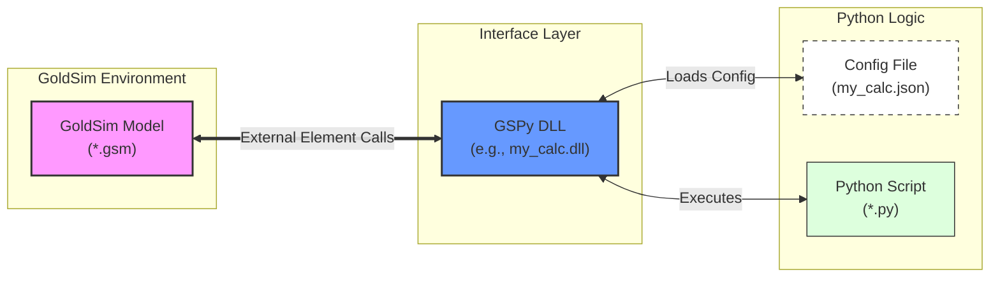

# GSPy: The GoldSim-Python Bridge

**Current Version: 1.8.9** | [Changelog](CHANGELOG.md)

GSPy is a C++ bridge that allows GoldSim models to call external Python scripts. It acts as a shim DLL for GoldSim's `External` element, enabling users to leverage the capabilities of the Python ecosystem directly within their dynamic simulations.

-----

## Table of Contents

- [GSPy: The GoldSim-Python Bridge](#gspy-the-goldsim-python-bridge)
  - [Table of Contents](#table-of-contents)
  - [Features](#features)
  - [How It Works](#how-it-works)
  - [Prerequisites](#prerequisites)
  - [Python Setup \& Troubleshooting](#python-setup--troubleshooting)
    - [**Requirement 1: Add Python to System PATH**](#requirement-1-add-python-to-system-path)
    - [**Requirement 2: Configure `python_path` in JSON**](#requirement-2-configure-python_path-in-json)
    - [Verifying Your Python Setup](#verifying-your-python-setup)
    - [Installation Tips for Windows Users](#installation-tips-for-windows-users)
    - [Troubleshooting Common Errors](#troubleshooting-common-errors)
  - [Downloading GSPy](#downloading-gspy)
  - [Quick Start Guide](#quick-start-guide)
    - [1. Create a Project Folder](#1-create-a-project-folder)
    - [2. Prepare the GSPy Files](#2-prepare-the-gspy-files)
    - [3. Create the Configuration File](#3-create-the-configuration-file)
    - [4. Create the Python Script](#4-create-the-python-script)
    - [5. Configure GoldSim](#5-configure-goldsim)
  - [Usage Reference](#usage-reference)
    - [Configuration (`.json`) File Details](#configuration-json-file-details)
    - [Performance Optimization](#performance-optimization)
    - [Python Script API](#python-script-api)
      - [Python Logging](#python-logging)
      - [Error Handling](#error-handling)
      - [Log File Format](#log-file-format)
      - [Data Type Mapping](#data-type-mapping)
  - [Extended Examples](#extended-examples)
    - [Example 1: Time Series Example](#example-1-time-series-example)
      - [Calendar-Based Time Series Example](#calendar-based-time-series-example)
    - [Example 2: Lookup Table (1D, 2D, and 3D)](#example-2-lookup-table-1d-2d-and-3d)
    - [Example 3: Mixed Data](#example-3-mixed-data)
  - [Developer Documentation](#developer-documentation)
    - [Multi-Python Build System](#multi-python-build-system)
      - [Prerequisites for Development](#prerequisites-for-development)
      - [Setting Up Environment Variables](#setting-up-environment-variables)
      - [Switching Between Python Versions](#switching-between-python-versions)
      - [Build Configurations](#build-configurations)
      - [Typical Development Workflows](#typical-development-workflows)
      - [Troubleshooting](#troubleshooting)
      - [Team Onboarding](#team-onboarding)
      - [Advanced Configuration](#advanced-configuration)
  - [Building from Source](#building-from-source)
    - [Updating Version Numbers](#updating-version-numbers)
  - [License](#license)

-----

## Features

  * **Seamless Integration:** Call Python scripts directly from a GoldSim `External` element.
  * **Data Marshalling:** Pass a variety of mixed data types to and from Python, including:
      * Scalars
      * Vectors (1D Arrays)
      * Matrices (2D Arrays)
      * Time Series
      * Lookup Tables (only from Python to GoldSim)
  * **Data-Driven Configuration:** A JSON file defines the interface, allowing for configurations without changing code.
  * **Error Handling:** Two-tier error handling system:
      * Graceful degradation for recoverable errors (log and continue)
      * Fatal error signaling with `gspy.error()` to stop simulations when results would be invalid
  * **Enhanced Diagnostic Logging:** Configurable logging system with automatic log file headers, thread-safe operations, and seamless Python integration.

-----

## How It Works

GSPy uses a modular, three-part architecture. The DLL acts as an interpreter and data marshaller between the two environments. A naming convention ensures that the correct DLL is always linked to the correct configuration file.



GSPy links three files together: the DLL, the JSON configuration, and the Python script.

**The DLL and JSON file names MUST Match:** The GSPy DLL and its JSON configuration file must have the exact same name and be in the same directory. The DLL looks for a .json file with its own name.

Correct: GSPy_Model.dll and GSPy_Model.json

Incorrect: GSPy_Model.dll and config.json

The JSON points to the Python Script: The "script_path" field inside the JSON file tells the DLL which Python script to execute. The Python script can be named anything and be located anywhere, as long as the path is correct.

-----

## Prerequisites

To use the pre-compiled GSPy DLLs (v1.8.0+), you will need:

1.  **GoldSim 15+** (The provided DLLs are 64-bit).
2.  A **64-bit** installation of **Python 3.11** OR **Python 3.14**.
    * GSPy v1.8.0+ specifically requires one of these two versions due to changes in the Python C-API and the way the DLLs are compiled. Ensure you have the correct 64-bit installer from [python.org](https://www.python.org/).
    * You must install the Python version matching the GSPy DLL you intend to use (e.g., `GSPy_Release_py311.dll` requires Python 3.11).
3.  The **NumPy** and **SciPy** Python packages installed *for the specific Python version you are using*.
    * **NumPy** is required for basic GSPy operation (handling arrays).
    * **SciPy** is required for advanced numerical methods like implicit equation solving (used in some examples posted on our website) and other scientific computing tasks. It is recommended for broader GSPy usage.
    * After installing Python, open a command prompt and run the appropriate command:
        * For Python 3.11: `py -3.11 -m pip install numpy scipy`
        * For Python 3.14: `py -3.14 -m pip install numpy scipy`
4.  **Python Directory Added to System PATH:**
    * The installation directory of your chosen Python version (e.g., `C:\...\Python314`) **must** be added to your Windows system `PATH` environment variable.
    * **Reason:** This is required so that Windows can find the necessary Python runtime DLL (e.g., `python311.dll`) when GoldSim initially tries to load the `GSPy_*.dll`. See "Method 2" below for instructions.
5.  **JSON `python_path` Configured:**
    * You must configure the `python_path` setting inside the `GSPy_*.json` configuration file to point to the *exact* installation directory of the required Python version.
    * **Reason:** This path is used by the GSPy C++ code at runtime to initialize the correct embedded Python interpreter. See "Method 1" below for instructions.

-----

## Python Setup & Troubleshooting

Correctly configuring Python paths is essential for GSPy to function. There are two critical path settings: the **System PATH** (for Windows to load the DLL) and the **JSON `python_path`** (for GSPy to initialize Python).

### **Requirement 1: Add Python to System PATH**

This allows Windows to find the core Python DLL (e.g., `python311.dll`) needed by `GSPy_*.dll` when GoldSim starts. **This is mandatory.**

1.  **Find Python Path:** Locate your Python 3.11 or 3.14 installation directory (e.g., `C:\Users\YourUsername\AppData\Local\Programs\Python\Python311`).
2.  **Edit System Environment Variables:** Search for "Environment Variables" in the Windows Start Menu and click "Edit the system environment variables".
3.  Click **"Environment Variables..."**.
4.  Under **"System variables"**, find and select **"Path"**, then click **"Edit..."**.
5.  Click **"New"** and add your Python installation directory (e.g., `C:\Users\YourUsername\AppData\Local\Programs\Python\Python314`).
6.  *(Optional but Recommended)* Click **"New"** again and add the corresponding `Scripts` directory (e.g., `C:\Users\YourUsername\AppData\Local\Programs\Python\Python311\Scripts`).
7.  Click **"OK"** on all dialogs.
8.  This may require a system restart for the changes to take effect.

### **Requirement 2: Configure `python_path` in JSON**

This tells the GSPy C++ code which specific Python interpreter to initialize and use for running your script. **This is mandatory.**

1.  **Open** the `GSPy_*.json` file corresponding to the DLL you are using (e.g., `GSPy_PY311.json`).
2.  **Edit** the `python_path` value. It must be the full, absolute path to the root directory of the matching Python installation. Use double backslashes (`\\`).

    ```json
    {
      "python_path": "C:\\Users\\YourUsername\\AppData\\Local\\Programs\\Python\\Python311",
      "script_path": "your_script.py",
      "function_name": "process_data",
      "log_level": 3,
      "inputs": [...],
      "outputs": [...]
    }
    ```
3.  **Save** the JSON file.

### Verifying Your Python Setup

Before using GSPy, verify your installations:

1.  **Open a NEW Command Prompt** (after setting PATH and restarting if necessary).
2.  **Verify PATH:** Type `where python`. You should see the path to your desired Python version (3.11 or 3.14) listed.
3.  **Test Correct Python Version:**
    * If using 3.11: `py -3.11 --version` (Should show 3.11.x)
    * If using 3.14: `py -3.14 --version` (Should show 3.14.x)
4.  **Test NumPy/SciPy Installation:**
    * If using 3.11: `py -3.11 -c "import numpy, scipy; print('NumPy & SciPy for 3.11 OK')"`
    * If using 3.14: `py -3.14 -c "import numpy, scipy; print('NumPy & SciPy for 3.14 OK')"`

If any command fails, review the installation steps and path settings.

### Installation Tips for Windows Users

* **Use the official Python installer** from [python.org](https://python.org).
* **Recommended:** Check **"Add python.exe to PATH"** during installation (though verify it adds the correct version if you have multiple installs).
* **Use Python 3.11 or 3.14 (64-bit)** as required by GSPy v1.8.0+.
* **Always use 64-bit Python** (required for GSPy DLLs).

### Troubleshooting Common Errors

1.  **GoldSim Error: "Cannot load DLL..." (No Log File Created)**
    * **Cause:** Windows cannot find the required `pythonXXX.dll` (e.g., `python311.dll`) dependency for your `GSPy_*.dll`.
    * **Solution:** Ensure the correct Python installation directory (3.11 or 3.14) is added to your system `PATH` environment variable and that you have restarted GoldSim/your computer. Alternatively, manually copy the required `pythonXXX.dll` from the Python installation folder into the same directory as your `GSPy_*.dll`.
2.  **GSPy Log Error: `Could not initialize NumPy C-API`**
    * **Cause:** Usually a mismatch between the Python version GSPy was compiled for and the Python version found/used at runtime, or NumPy not installed correctly for that version.
    * **Solution:** Verify you are using the correct GSPy DLL (`_py311` or `_py314`) for your installed Python version. Double-check the `python_path` in your JSON file is correct. Ensure NumPy is installed for that specific Python version (`py -X.Y -m pip install numpy`).
3.  **GSPy Log Error: `Failed to load Python script...` or `Cannot find function...`**
    * **Cause:** GSPy initialized Python correctly but couldn't find/import your `.py` file or the specified function within it.
    * **Solution:** Check the `script_path` and `function_name` in your JSON file. Ensure the `.py` file exists at that location and doesn't have syntax errors. Make sure the function name matches exactly.
4.  **Check JSON `python_path`:** Verify it matches your actual installation directory precisely (use `where python` or `py -X.Y -c "import sys; print(sys.executable)"` to confirm).
5.  **Verify Python is 64-bit:** Use `py -X.Y -c "import platform; print(platform.architecture())"`. Should show '64bit'.
6.  **Check file permissions:** Ensure GoldSim/GSPy has permission to read the Python directory and your script file.
7.  **Restart GoldSim:** Especially after changing environment variables.

-----

## Downloading GSPy

GSPy releases are distributed as `.zip` files containing the compiled DLLs and documentation. To download:

1. Visit the [GSPy Releases page](https://github.com/GoldSim/gspy/releases)
2. Look for the latest release (at the top of the page)
3. Under "Assets", click on the `.zip` file to download it
4. Extract the `.zip` file to a folder on your computer

**Direct Download**: [Download Latest Release (v1.8.6)](https://github.com/GoldSim/GSPy/releases/latest/download/GSPy-v1.8.6.zip)

The release package includes:
- Compiled DLLs for Python 3.11 and 3.14 (64-bit)
- Complete documentation (README.md)
- Example files and configurations

-----

## Building from Source - Quick Setup

If you're building GSPy from source, you need to set up environment variables first:

**Step 1: Set Environment Variables**
1. Press Windows key and search for "Environment Variables"
2. Click "Edit the system environment variables"
3. Click "Environment Variables..." button
4. Under "System variables", click "New" and add:
   - **Variable name**: `PYTHON_3_11_HOME`
   - **Variable value**: Your Python 3.11 path (e.g., `C:\Users\YourName\AppData\Local\Programs\Python\Python311`)
5. Click "New" again and add:
   - **Variable name**: `PYTHON_3_14_HOME`
   - **Variable value**: Your Python 3.14 path (e.g., `C:\Users\YourName\AppData\Local\Programs\Python\Python314`)
6. Click OK to save

**Step 2: Find Your Python Path**
If you don't know your Python installation path, open Command Prompt and run:
```cmd
where python
```
Or check these common locations:
- `C:\Users\[YourName]\AppData\Local\Programs\Python\Python311`
- `C:\Users\[YourName]\AppData\Local\Programs\Python\Python314`
- `C:\Python311` or `C:\Python314`

**Step 3: Restart Visual Studio**
Close and reopen Visual Studio for the environment variables to take effect.

**Step 4: Build**
1. Open `GSPy.sln` in Visual Studio
2. Select "Release" and "x64" from the toolbar
3. Build → Build Solution (or press F7)

For detailed build instructions, see [Developer Documentation](#developer-documentation) below.

-----

## Quick Start Guide

This guide will run a simple "scalar in, scalar out" test.

### 1\. Create a Project Folder

Create a new, empty folder on your computer to hold all the files for your test.

### 2\. Prepare the GSPy Files

Copy the base `GSPy.dll` into your new folder and rename it to **`scalar_test.dll`**.

### 3\. Create the Configuration File

In the same folder, create a new text file named **`scalar_test.json`** and paste the following content. **Remember to update the `python_path`**. Note the *.json configuration file must have the same name as the DLL.

```json
{
  "python_path": "C:\\Users\\username\\AppData\\Local\\Programs\\Python\\Python314",
  "script_path": "scalar_test.py",
  "function_name": "process_data",
  "log_level": 0,
  "inputs": [
    {
      "name": "input_scalar",
      "type": "scalar",
      "dimensions": []
    }
  ],
  "outputs": [
    {
      "name": "output_scalar",
      "type": "scalar",
      "dimensions": []
    }
  ]
}
```

### 4\. Create the Python Script

In the same folder, create a script named **`scalar_test.py`** (the name doesn't need to be the same as the dll or json file) and paste the following content:

```python
import traceback
import gspy

def process_data(*args):
  """
  Receives one scalar, multiplies it by 10, and returns one scalar.
  """
  try:
    gspy.log("Starting scalar calculation", 2)  # INFO level
    input_scalar = args[0]
    gspy.log(f"Input value: {input_scalar}", 3)  # DEBUG level
    
    result = input_scalar * 10.0
    gspy.log(f"Calculation complete, result: {result}", 2)  # INFO level
    
    # The return value MUST be a tuple
    return (result,)
  except Exception:
    gspy.log("Error in calculation: " + traceback.format_exc(), 0)  # ERROR level
    return (0.0,)
```

### 5\. Configure GoldSim

1.  Create a new GoldSim model and save it in your project folder.
2.  Create an `External` element.
3.  In its properties, set the **DLL Path** to **`scalar_test.dll`** and the Function Name to GSPy.
4.  Go to the **Interface** tab and define **one scalar input** and **one scalar output**.
5.  Run the model. The result should be 10 times the input.

-----

## Usage Reference

### Configuration (`.json`) File Details

  * **`python_path`**: Full path to your Python installation directory.
  * **`script_path`**: The name of your Python script.
  * **`function_name`**: The function in your script that GSPy will call (default: "process_data")
  * **`inputs` / `outputs`**: Lists of data objects. **The order must match the order in the GoldSim Interface tab.**
      * **`name`**: A descriptive name for your reference.
      * **`type`**: Can be `"scalar"`, `"vector"`, `"matrix"`, `"timeseries"`, or `"table"` (table only available for outputs).
      * **`dimensions`**: The shape of the data. Use `[]` for scalars or scalar time series, `[10]` for a 10-element vector, `[5, 3]` for a 5x3 matrix
      * **`max_points` / `max_elements`**: Required for `"timeseries"` or `"table"` to pre-allocate memory (only required for outputs from python to GoldSim)
  * **`log_level`** (Optional): Controls logging verbosity with atomic-level performance optimization. Default is 2 (INFO).
      * **`0`** = ERROR only (fastest, ~90-95% performance improvement for production)
      * **`1`** = ERROR + WARNING (optimized for critical issues)
      * **`2`** = ERROR + WARNING + INFO (default, balanced performance)
      * **`3`** = ERROR + WARNING + INFO + DEBUG (full verbosity, development only)

### Performance Optimization

GSPy features a high-performance logging system with atomic-level filtering and thread-safe operations. For production simulations, add `"log_level": 0` to your JSON configuration:

```json
{
  "python_path": "C:\\Users\\username\\AppData\\Local\\Programs\\Python\\Python314",
  "script_path": "my_script.py", 
  "function_name": "process_data",
  "log_level": 0,
  "inputs": [...],
  "outputs": [...]
}
```

**Performance Benefits:**
- **Fast-path filtering**: Disabled log levels have minimal overhead
- **Atomic operations**: Thread-safe level checking without locks
- **Hybrid flush policy**: Immediate flush for errors/warnings, write-only for info/debug
- **Automatic fallback**: stderr redirect if file operations fail


### Python Script API

  * Your function (e.g., `process_data`) must accept arguments using **`*args`**.
  * Inputs are passed in a tuple (`args`) in the order defined in the JSON.
  * Your function **must** return a **tuple** of results, even if there is only one (e.g., `return (my_result,)`). The order must match the JSON `outputs`.

#### Python Logging

Python scripts can write custom messages to the GSPy log file using the enhanced `gspy` module with thread-safe logging:

```python
import gspy

def process_data(*args):
    # Write messages at different log levels (with atomic filtering)
    gspy.log("Starting calculation", 2)  # INFO level
    gspy.log("Debug info: processing input", 3)  # DEBUG level  
    gspy.log("Warning: unusual input value", 1)  # WARNING level
    gspy.log("Critical error occurred", 0)  # ERROR level
    
    # Default level is INFO (2) if not specified
    gspy.log("Simple message")
    
    # Your calculation logic here...
    return (result,)
```

**Python Logging Features:**
- **Thread-safe operations**: Safe for concurrent access with DLL logging
- **Atomic filtering**: Disabled levels have minimal performance impact
- **Reentrancy protection**: Prevents infinite recursion in logging calls
- **Unified output**: Python and DLL messages appear in the same log file with consistent formatting

**Log Levels:** 0=ERROR, 1=WARNING, 2=INFO (default), 3=DEBUG

#### Error Handling

GSPy provides two approaches for handling errors in Python code:

**1. Graceful Degradation** (Log only - GoldSim simulation continues):
```python
import gspy
import traceback

def process_data(*args):
    try:
        result = calculate(args)
        return (result,)
    except ValueError as e:
        # Log warning and continue with safe fallback
        gspy.log(f"Warning: {e}. Using default value.", 1)
        return (0.0,)
```

**2. Fatal Error Signaling** (Stop simulation):
```python
import gspy
import traceback

def process_data(*args):
    try:
        result = calculate(args)
        return (result,)
    except Exception as e:
        # Log detailed traceback
        gspy.log(traceback.format_exc(), 0)
        
        # Signal fatal error - stops simulation
        gspy.error(f"Critical error: {str(e)}")
        
        return (0.0,)  # Required but not used
```

**When to use `gspy.error()`:**
- Division by zero or math domain errors
- Required files or data missing
- Invalid configuration that prevents calculation
- Any error that makes results unreliable

**What happens:**
- Simulation stops immediately
- GoldSim shows: "Error in external function. Return code 1."
- Detailed error message and full Python traceback written to log file
- **Note:** Due to 32-bit GoldSim / 64-bit DLL architecture, error messages appear in the log file rather than GoldSim dialogs

**Comparison:**

| Approach | Function | Simulation | Error Details |
|----------|----------|------------|---------------|
| Graceful Degradation | `gspy.log()` only | Continues | Log file |
| Fatal Error | `gspy.error()` | **Stops** | Log file |

**When you see "Error in external function. Return code 1." in GoldSim:**

This means your Python code called `gspy.error()` to stop the simulation. To find out why:

1. **Open the log file** - Located in the same directory as your .gsm file
2. **Look for ERROR entries** - Scroll to the bottom or search for "ERROR:"
3. **Read the details** - You'll find:
   - Your custom error message from `gspy.error()`
   - Full Python traceback showing exactly where the error occurred
   - Any additional context from `gspy.log()` calls

**Example log output:**
```
2025-11-18 11:51:11 - ERROR: Validation error: Traceback (most recent call last):
  File "error_demo.py", line 37, in process_data
    raise ValueError(f"Input value must be non-negative, got {input_value}")
ValueError: Input value must be non-negative, got -0.45

2025-11-18 11:51:11 - ERROR: Invalid input: Input value must be non-negative, got -0.45
2025-11-18 11:51:11 - ERROR: Fatal error to report to GoldSim: GSPy Error: Invalid input...
```

**Why not show the error in GoldSim's dialog?**  
GoldSim is 32-bit and GSPy is 64-bit, so they run in separate processes and cannot share memory. This is by design to support modern Python versions (3.11+). The log file is the authoritative source for debugging.

**See also:** [Error Handling Best Practices](Error_Handling_Best_Practices.md) | [Quick Reference](Error_Handling_Quick_Reference.md) | [Using gspy.error()](Using_gspy_error.md)

#### Log File Format

Each GSPy run automatically creates a log file with a clean header:

```
========================================
GSPy: The GoldSim-Python Bridge
Version: 1.8.6
========================================
2025-11-07 20:14:50 - INFO: Starting scalar calculation
2025-11-07 20:14:50 - INFO: Calculation complete, result: 50.0
```


#### Data Type Mapping

| From GoldSim | Received in Python as...                                                             |
| :----------- | :----------------------------------------------------------------------------------- |
| Scalar       | `float`                                                                              |
| Vector       | 1D NumPy Array                                                                       |
| Matrix       | 2D NumPy Array                                                                       |
| Time Series  | Python Dictionary with keys: `"timestamps"`, `"data"`, `"time_basis"`, `"data_type"` |

**Time Series Data Shapes**:
- **Scalar Time Series**: `"data"` is 1D NumPy array with shape `(num_time_points,)`
- **Vector Time Series**: `"data"` is 2D NumPy array with shape `(num_rows, num_time_points)`
- **Matrix Time Series**: `"data"` is 3D NumPy array with shape `(num_rows, num_cols, num_time_points)`

| To GoldSim   | Returned from Python as...                                                                             |
| :----------- | :----------------------------------------------------------------------------------------------------- |
| Scalar       | `float` or `int`                                                                                       |
| Vector       | 1D NumPy Array                                                                                         |
| Matrix       | 2D NumPy Array                                                                                         |
| Time Series  | Python Dictionary with keys: `"timestamps"`, `"data"`, `"time_basis"`, `"data_type"`                   |
| Lookup Table | Python Dictionary with keys: `"table_dim"`, `"row_labels"`, `"col_labels"`, `"layer_labels"`, `"data"` |

**Important**: For time series outputs, the `"data"` array must follow the same shape conventions as inputs. Time is always the last dimension.

-----
## Extended Examples

### Example 1: Time Series Example
This example demonstrates how to handle all three types of time series data: scalar, vector, and matrix time series. It shows the correct NumPy array shapes and how to process them in Python.

**GSPy_TS_Test.json**
This configuration defines the interface for scalar, vector, and matrix time series. Note that `max_points` is required for outputs to pre-allocate memory.

```json
{
  "python_path": "C:\\Users\\username\\AppData\\Local\\Programs\\Python\\Python314",
  "script_path": "test_timeseries.py",
  "function_name": "process_data",
  "log_level": 3,
  "inputs": [
    {
      "name": "input_scalar_ts",
      "type": "timeseries",
      "dimensions": []
    },
    {
      "name": "input_vector_ts",
      "type": "timeseries",
      "dimensions": [2]
    },
    {
      "name": "input_matrix_ts",
      "type": "timeseries",
      "dimensions": [3, 2]
    }
  ],
  "outputs": [
    {
      "name": "output_vector_ts",
      "type": "timeseries",
      "dimensions": [2],
      "max_points": 1000
    },
    {
      "name": "output_scalar_ts",
      "type": "timeseries",
      "dimensions": [],
      "max_points": 1000
    },
    {
      "name": "output_matrix_ts",
      "type": "timeseries",
      "dimensions": [2, 3],
      "max_points": 1000
    }
  ]
}
```

**test_timeseries.py**
The Python script demonstrates handling of different time series array shapes and performs simple transformations.

```python
import numpy as np
import traceback
import gspy

def process_data(*args):
  """
  Receives scalar, vector, and matrix time series.
  Returns vector, scalar, and matrix time series with transformations.
  """
  try:
    # 1. Unpack the three input Time Series dictionaries
    input_ts_scalar_dict = args[0]
    input_ts_vector_dict = args[1]
    input_ts_matrix_dict = args[2]
    
    # 2. Extract the data and timestamps from each
    scalar_timestamps = input_ts_scalar_dict["timestamps"]
    scalar_data = input_ts_scalar_dict["data"]  # Shape: (num_time_points,)
    
    vector_timestamps = input_ts_vector_dict["timestamps"]
    vector_data = input_ts_vector_dict["data"]  # Shape: (2, num_time_points)
    
    matrix_timestamps = input_ts_matrix_dict["timestamps"]
    matrix_data = input_ts_matrix_dict["data"]  # Shape: (3, 2, num_time_points)

    gspy.log("--- Python Script Received ---", 2)
    gspy.log(f"Scalar TS data shape: {scalar_data.shape}", 3)
    gspy.log(f"Vector TS data shape: {vector_data.shape}", 3)
    gspy.log(f"Matrix TS data shape: {matrix_data.shape}", 3)
    gspy.log(f"Time basis: {input_ts_scalar_dict['time_basis']} (0=elapsed time, 1=calendar dates)", 3)
    gspy.log(f"Data type: {input_ts_scalar_dict['data_type']} (0=instantaneous, 1=constant, 2=change, 3=discrete)", 3)
    
    # 3. Prepare the outputs with simple transformations
    
    # Output 1: Vector time series - Scale the input vector by 2
    output_vector_data = vector_data * 2.0
    output_ts_vector = {
        "timestamps": vector_timestamps,
        "data": output_vector_data,
        "time_basis": input_ts_vector_dict["time_basis"],
        "data_type": input_ts_vector_dict["data_type"]
    }
    
    # Output 2: Scalar time series - Sum scalar with mean of first vector row
    vector_row1_mean = np.mean(vector_data[0, :])
    output_scalar_data = scalar_data + vector_row1_mean
    output_ts_scalar = {
        "timestamps": scalar_timestamps,
        "data": output_scalar_data,
        "time_basis": input_ts_scalar_dict["time_basis"],
        "data_type": input_ts_scalar_dict["data_type"]
    }
    
    # Output 3: Matrix time series (2x3) - Transpose and extend input matrix
    # Take first 2 rows and transpose to get 2x3 matrix
    matrix_subset = matrix_data[:2, :, :]  # Shape: (2, 2, num_time_points)
    processed_matrix_data = np.transpose(matrix_subset, (1, 0, 2))  # Shape: (2, 2, num_time_points)
    
    # Extend to 2x3 by adding a third column
    num_time_points = processed_matrix_data.shape[2]
    extended_matrix = np.zeros((2, 3, num_time_points))
    extended_matrix[:, :2, :] = processed_matrix_data  # Fill first 2 columns
    extended_matrix[:, 2, :] = processed_matrix_data[:, 1, :] * 1.5  # Third column = 1.5 * second column
    
    output_ts_matrix = {
        "timestamps": matrix_timestamps[:num_time_points],  # Match time points
        "data": extended_matrix,
        "time_basis": input_ts_matrix_dict["time_basis"],
        "data_type": input_ts_matrix_dict["data_type"]
    }

    gspy.log("--- Python Script Outputs ---", 2)
    gspy.log(f"Output Vector shape: {output_vector_data.shape}", 3)
    gspy.log(f"Output Scalar shape: {output_scalar_data.shape}", 3)
    gspy.log(f"Output Matrix shape: {extended_matrix.shape}", 3)

    # 4. Return the results as a tuple in the correct order
    return (output_ts_vector, output_ts_scalar, output_ts_matrix)

  except Exception:
    gspy.log("!!! PYTHON EXCEPTION !!!", 0)
    gspy.log(traceback.format_exc(), 0)
    # In case of error, return properly formatted empty time series
    dummy_ts_vector = {"timestamps": np.array([0.0]), "data": np.zeros((2, 1)), "time_basis": 0.0, "data_type": 0.0}
    dummy_ts_scalar = {"timestamps": np.array([0.0]), "data": np.zeros(1), "time_basis": 0.0, "data_type": 0.0}
    dummy_ts_matrix = {"timestamps": np.array([0.0]), "data": np.zeros((2, 3, 1)), "time_basis": 0.0, "data_type": 0.0}
    return (dummy_ts_vector, dummy_ts_scalar, dummy_ts_matrix)
```

**Time Series Array Shapes**:

GSPy uses consistent NumPy array shapes for time series data:

- **Scalar Time Series**: 1D array with shape `(num_time_points,)`
- **Vector Time Series**: 2D array with shape `(num_rows, num_time_points)`
- **Matrix Time Series**: 3D array with shape `(num_rows, num_cols, num_time_points)`

**Key Points**:
- Time is always the **last dimension** (fastest-changing in memory)
- For matrix time series, the shape is `(rows, columns, time_points)`

**Time Series Dictionary Format**: Time series are passed as Python dictionaries with **four required keys**:
- `"timestamps"`: 1D NumPy array of time values
- `"data"`: NumPy array containing the time series values (see shapes above)
- `"time_basis"`: Float value indicating time format:
  - `0.0` = Elapsed time (e.g., days since simulation start: 0, 33, 100)
  - `1.0` = Calendar dates (actual datetime values)
- `"data_type"`: Float value indicating data interpretation:
  - `0.0` = Instantaneous value
  - `1.0` = Constant value over next time interval
  - `2.0` = Change over next time interval  
  - `3.0` = Discrete change

**Time Handling**: GSPy handles both elapsed time and calendar date time series. The `timestamps` array contains the actual time values (elapsed days or date values), and the `time_basis` field tells GoldSim how to interpret them. Always preserve these values when creating output time series.

**Memory Allocation**: You must specify `"max_points"` for any output time series in the JSON file. This allows GoldSim to allocate the necessary memory buffer to receive the data from Python.

**Important**: Always preserve the `time_basis` and `data_type` values from input time series when creating outputs. These contain metadata that GoldSim requires.

#### Calendar-Based Time Series Example

For calendar-based time series (e.g., simulation starting September 12, 2025 with 100-day duration), the timestamps will be Julian day numbers and `time_basis = 1.0`. Here's how to handle them:

```python
import numpy as np
import traceback
import gspy

def process_data(*args):
  """
  Receives a scalar time series, a vector time series, and a matrix time series.
  
  Returns a vector time series (2 items), scalar time series, and matrix time series (2x3).
  """
  try:
    # 1. Unpack the three input Time Series dictionaries
    input_ts_scalar_dict = args[0]
    input_ts_vector_dict = args[1]
    input_ts_matrix_dict = args[2]
    
    # 2. Extract the data and timestamps from each
    scalar_timestamps = input_ts_scalar_dict["timestamps"]
    scalar_data = input_ts_scalar_dict["data"]  # Shape: (3,) - values [1, 10, 5]
    
    vector_timestamps = input_ts_vector_dict["timestamps"]
    vector_data = input_ts_vector_dict["data"]  # Shape: (2, 3) - 2 rows, 3 time points
    
    matrix_timestamps = input_ts_matrix_dict["timestamps"]
    matrix_data = input_ts_matrix_dict["data"]  # Shape: (3, 2, 6) - 3 rows, 2 cols, 6 time points

    gspy.log("--- Python Script Received ---", 2)
    gspy.log(f"Scalar TS data shape: {scalar_data.shape}, values: {scalar_data}", 3)
    gspy.log(f"Scalar TS timestamps: {scalar_timestamps}", 3)
    gspy.log(f"Scalar TS time_basis: {input_ts_scalar_dict['time_basis']} (0=elapsed, 1=calendar)", 3)
    gspy.log(f"Vector TS data shape: {vector_data.shape}", 3)
    gspy.log(f"Vector TS timestamps: {vector_timestamps}", 3)
    gspy.log(f"Vector TS time_basis: {input_ts_vector_dict['time_basis']} (0=elapsed, 1=calendar)", 3)
    gspy.log(f"Matrix TS data shape: {matrix_data.shape}", 3)
    gspy.log(f"Matrix TS timestamps: {matrix_timestamps}", 3)
    gspy.log(f"Matrix TS time_basis: {input_ts_matrix_dict['time_basis']} (0=elapsed, 1=calendar)", 3)
    
    # 3. Prepare the outputs
    
    # Output 1: Vector time series (2 items) - Scale the input vector by 2
    output_vector_data = vector_data * 2.0  # Simple scaling transformation
    output_ts_vector = {
        "timestamps": vector_timestamps,
        "data": output_vector_data,
        "data_type": input_ts_vector_dict["data_type"],  # Preserve input data_type
        "time_basis": input_ts_vector_dict["time_basis"]  # Preserve input time_basis
    }
    
    # Output 2: Scalar time series - Sum the scalar input with the mean of the first vector row
    vector_row1_mean = np.mean(vector_data[0, :])  # Mean of first row of vector
    output_scalar_data = scalar_data + vector_row1_mean  # Add mean to each scalar value
    output_ts_scalar = {
        "timestamps": scalar_timestamps,
        "data": output_scalar_data,
        "data_type": input_ts_scalar_dict["data_type"],  # Preserve input data_type
        "time_basis": input_ts_scalar_dict["time_basis"]  # Preserve input time_basis
    }
    
    # Output 3: Matrix time series (2x3) - Transpose and take subset of input matrix
    # Take first 2 rows and transpose to get 2x3 matrix, use first 3 time points
    matrix_subset = matrix_data[:2, :, :3]  # Take first 2 rows, all columns, first 3 time points
    processed_matrix_data = np.transpose(matrix_subset, (1, 0, 2))  # Shape becomes (2, 2, 3)
    
    # Extend to 2x3 by duplicating the second row
    extended_matrix = np.zeros((2, 3, 3))
    extended_matrix[:, :2, :] = processed_matrix_data  # Fill first 2 columns
    extended_matrix[:, 2, :] = processed_matrix_data[:, 1, :] * 1.5  # Third column = 1.5 * second column
    
    output_ts_matrix = {
        "timestamps": scalar_timestamps,  # Use scalar timestamps (3 points) for output matrix
        "data": extended_matrix,
        "data_type": input_ts_scalar_dict["data_type"],  # Preserve input data_type
        "time_basis": input_ts_scalar_dict["time_basis"]  # Preserve input time_basis
    }

    gspy.log("--- Python Script Outputs ---", 2)
    gspy.log(f"Output Vector shape: {output_vector_data.shape}", 3)
    gspy.log(f"Output Scalar shape: {output_scalar_data.shape}", 3)
    gspy.log(f"Output Matrix shape: {extended_matrix.shape}", 3)

    # 4. Return the results as a tuple in the correct order
    return (output_ts_vector, output_ts_scalar, output_ts_matrix)

  except Exception as e:
    gspy.log("!!! PYTHON EXCEPTION !!!", 0)
    gspy.log(traceback.format_exc(), 0)
    
    # In case of error, return a tuple of the correct size/shape with dummy values
    # Try to preserve time_basis from inputs if available, otherwise default to elapsed time
    try:
        time_basis = args[0]["time_basis"] if len(args) > 0 else 0.0
        data_type = args[0]["data_type"] if len(args) > 0 else 0.0
        # Use appropriate dummy timestamps based on time_basis
        if time_basis == 1.0:  # Calendar dates
            dummy_timestamps = np.array([45543.0, 45544.0, 45545.0])  # Approx Sept 12-14, 2025
        else:  # Elapsed time
            dummy_timestamps = np.array([0, 1, 2])
    except:
        time_basis = 0.0
        data_type = 0.0
        dummy_timestamps = np.array([0, 1, 2])
    
    dummy_ts_vector = {"timestamps": dummy_timestamps, "data": np.zeros((2, 3)), "data_type": data_type, "time_basis": time_basis}
    dummy_ts_scalar = {"timestamps": dummy_timestamps, "data": np.zeros(3), "data_type": data_type, "time_basis": time_basis}
    dummy_ts_matrix = {"timestamps": dummy_timestamps, "data": np.zeros((2, 3, 3)), "data_type": data_type, "time_basis": time_basis}
    return (dummy_ts_vector, dummy_ts_scalar, dummy_ts_matrix)
```

**Key Points for Calendar Time Series**:
- **Timestamps**: Julian day numbers (e.g., 45543.0 ≈ September 12, 2025)
- **time_basis = 1.0**: Tells GoldSim these are calendar dates
- **No conversion needed**: Work with raw timestamp values; GoldSim handles date interpretation
- **Preserve metadata**: Always return the same `time_basis` and `data_type` values

-----

### Example 2: Lookup Table (1D, 2D, and 3D)

This example demonstrates how to dynamically generate complete GoldSim Lookup Tables from within Python. It shows full support for 1D, 2D, and 3D tables. The example takes a single scalar value from GoldSim and uses it to construct all three table types, demonstrating the complete range of GSPy's lookup table capabilities. **This example has been successfully tested and verified to work correctly with GoldSim.**

**LookupTable.json**
The JSON configuration specifies multiple table outputs. For table outputs, you must provide "max_elements" so GoldSim can pre-allocate enough memory. This should be a safe upper bound for the total number of elements (data + labels).

```json
{
  "python_path": "C:\\Users\\username\\AppData\\Local\\Programs\\Python\\Python314",
  "script_path": "lookup_table_script.py",
  "function_name": "process_data",
  "inputs": [
    {
      "name": "input_scalar",
      "type": "scalar",
      "dimensions": []
    }
  ],
  "outputs": [
    {
      "name": "output_table_1d",
      "type": "table",
      "max_elements": 100
    },
    {
      "name": "output_table_2d",
      "type": "table",
      "max_elements": 500
    },
    {
      "name": "output_table_3d",
      "type": "table",
      "max_elements": 1000
    }
  ]
}
```

**lookup_table_script.py**
To return lookup tables, the Python script must construct and return dictionaries with specific structures. GSPy supports 1D, 2D, and 3D tables with different required keys.

```python
import numpy as np
import traceback
import gspy

def process_data(*args):
  """
  Receives a scalar and uses it to generate 1D, 2D, and 3D Lookup Tables.
  Demonstrates the complete range of GSPy's lookup table capabilities.
  """
  try:
    # 1. Unpack the input scalar
    input_scalar = args[0]
    
    gspy.log(f"--- Generating 1D, 2D, and 3D Lookup Tables (input_scalar = {input_scalar}) ---", 2)
    
    # 2. Generate 1D Lookup Table
    row_labels_1d = np.array([0.0, 10.0, 20.0, 30.0, 40.0]) * input_scalar
    data_1d = np.array([1.0, 4.0, 9.0, 16.0, 25.0]) * input_scalar  # Quadratic function
    
    table_1d_dictionary = {
      "table_dim": 1,
      "row_labels": row_labels_1d,
      "data": data_1d
    }
    
    # 3. Generate 2D Lookup Table
    row_labels_2d = np.arange(4) * input_scalar
    col_labels_2d = np.arange(3) + 1
    data_2d = np.outer(row_labels_2d, col_labels_2d)

    table_2d_dictionary = {
      "table_dim": 2,
      "row_labels": row_labels_2d,
      "col_labels": col_labels_2d,
      "data": data_2d
    }
    
    # 4. Generate 3D Lookup Table
    row_labels_3d = np.array([10.0, 20.0, 30.0]) * input_scalar
    col_labels_3d = np.array([1.0, 2.0]) + input_scalar
    layer_labels_3d = np.array([100.0, 200.0, 300.0, 400.0])
    
    # Create 3D data array (rows × cols × layers)
    num_rows, num_cols, num_layers = len(row_labels_3d), len(col_labels_3d), len(layer_labels_3d)
    data_3d = np.zeros((num_rows, num_cols, num_layers))
    
    # Fill with data that depends on all three dimensions
    for r in range(num_rows):
        for c in range(num_cols):
            for l in range(num_layers):
                data_3d[r, c, l] = (row_labels_3d[r] + col_labels_3d[c] * layer_labels_3d[l]) * input_scalar

    table_3d_dictionary = {
      "table_dim": 3,
      "row_labels": row_labels_3d,
      "col_labels": col_labels_3d,
      "layer_labels": layer_labels_3d,  # Required for 3D tables
      "data": data_3d
    }
    
    gspy.log("--- All lookup tables generated successfully ---", 2)
    
    # 5. Return all three tables as a tuple in the correct order
    return (table_1d_dictionary, table_2d_dictionary, table_3d_dictionary)

  except Exception:
    gspy.log("!!! PYTHON EXCEPTION !!!", 0)
    gspy.log(traceback.format_exc(), 0)
    # Return dummy tables in case of error
    dummy_1d = {"table_dim": 1, "row_labels": np.array([0.0, 1.0]), "data": np.array([1.0, 2.0])}
    dummy_2d = {"table_dim": 2, "row_labels": np.array([0.0]), "col_labels": np.array([0.0]), "data": np.array([[1.0]])}
    dummy_3d = {"table_dim": 3, "row_labels": np.array([0.0]), "col_labels": np.array([0.0]), "layer_labels": np.array([0.0]), "data": np.array([[[1.0]]])}
    return (dummy_1d, dummy_2d, dummy_3d)
```

**Lookup Table Dictionary Structure**:

**1D Table:**
- `"table_dim": 1`
- `"row_labels"`: 1D NumPy array of row values
- `"data"`: 1D NumPy array of dependent values

**2D Table:**
- `"table_dim": 2`
- `"row_labels"`: 1D NumPy array of row values
- `"col_labels"`: 1D NumPy array of column values
- `"data"`: 2D NumPy array of shape (num_rows, num_cols)

**3D Table:**
- `"table_dim": 3`
- `"row_labels"`: 1D NumPy array of row values
- `"col_labels"`: 1D NumPy array of column values
- `"layer_labels"`: 1D NumPy array of layer values
- `"data"`: 3D NumPy array of shape (num_rows, num_cols, num_layers)

**Important Notes:**
- All label arrays must contain monotonically increasing values
- Data array shape must match the dimensions defined by the labels
- 3D tables require the additional `"layer_labels"` key
- GSPy follows the GoldSim 3D table format: data[row, col, layer]

-----

### Example 3: Mixed Data

This is a "stress test" example that showcases the different types of data GSPy can work with. It demonstrates passing mixed data types (scalars, vectors, matrices, and time series) to Python in a single function call. The script then performs various calculations and returns a completely different set of outputs, including a dynamically generated Lookup Table.

```json
{
  "python_path": "C:\\Users\\username\\AppData\\Local\\Programs\\Python\\Python314",
  "script_path": "mixed_types.py",
  "function_name": "process_data",
  "inputs": [
    { "name": "input_vector", "type": "vector", "dimensions": [ 5 ] },
    { "name": "scalar_1", "type": "scalar", "dimensions": [] },
    { "name": "scalar_2", "type": "scalar", "dimensions": [] },
    { "name": "input_matrix", "type": "matrix", "dimensions": [ 3, 2 ] },
    { "name": "scalar_3", "type": "scalar", "dimensions": [] },
    { "name": "timeseries_1", "type": "timeseries", "dimensions": [] },
    { "name": "timeseries_2", "type": "timeseries", "dimensions": [] },
    { "name": "scalar_4", "type": "scalar", "dimensions": [] }
  ],
  "outputs": [
    { "name": "output_matrix", "type": "matrix", "dimensions": [ 4, 2 ] },
    { "name": "output_timeseries", "type": "timeseries", "dimensions": [], "max_points": 1000 },
    { "name": "output_scalar_1", "type": "scalar", "dimensions": [] },
    { "name": "output_table", "type": "table", "max_elements": 50 },
    { "name": "output_vector_1", "type": "vector", "dimensions": [ 6 ] },
    { "name": "output_vector_2", "type": "vector", "dimensions": [ 3 ] },
    { "name": "output_scalar_2", "type": "scalar", "dimensions": [] }
  ]
}

Below is the Python code to work with this json configuration file.

```python
import numpy as np
import traceback
import gspy

def process_data(*args):
  """
  Receives 9 inputs and returns 7 outputs of mixed types.
  """
  try:
    # 1. Unpack all 9 input arguments in order
    input_vector = args[0]
    scalar_1 = args[1]
    scalar_2 = args[2]
    input_matrix = args[3]
    scalar_3 = args[4]
    ts_dict_1 = args[5]
    ts_dict_2 = args[6]
    scalar_4 = args[7] # This input is unused, which is perfectly fine

    # 2. Perform various calculations to generate results
    v1 = np.arange(4) + scalar_1
    v2 = np.array([np.mean(input_vector), np.sum(input_matrix)])
    output_matrix = np.outer(v1, v2)
    output_scalar_1 = np.std(ts_dict_1['data']) + scalar_1
    output_vector_1 = input_matrix.flatten() * scalar_2
    data_2 = ts_dict_2['data']
    output_vector_2 = np.array([np.min(data_2), np.max(data_2), np.mean(data_2)])
    output_scalar_2 = np.dot(input_vector[:3], output_vector_2) + scalar_3

    # 3. Generate a new Time Series and Lookup Table
    output_timeseries = {
        "timestamps": ts_dict_1["timestamps"],
        "data": ts_dict_1["data"] + ts_dict_2["data"],
        "time_basis": ts_dict_1["time_basis"],
        "data_type": ts_dict_1["data_type"]
    }
    output_table = {
      "table_dim": 2,
      "row_labels": np.array([1, 2, 3]) + scalar_1,
      "col_labels": np.array([10, 20]) + scalar_2,
      "data": np.array([[1, 2], [3, 4], [5, 6]]) * scalar_3
    }

    # 4. Return all 7 results as a tuple in the specified output order
    return (
        output_matrix, 
        output_timeseries, 
        output_scalar_1, 
        output_table,
        output_vector_1, 
        output_vector_2, 
        output_scalar_2
    )

  except Exception:
    gspy.log("!!! PYTHON EXCEPTION !!!", 0)
    gspy.log(traceback.format_exc(), 0)
    # In case of error, return a tuple of the correct size with dummy values
    empty_ts = {"timestamps": np.array([0.0]), "data": np.array([0.0]), "time_basis": 0.0, "data_type": 0.0}
    empty_table = {}
    return (np.zeros((4,2)), empty_ts, 0.0, empty_table, np.zeros(6), np.zeros(3), 0.0)
```

Notes:

The order of variables received in Python's *args tuple is determined by their order in the "inputs" array of the JSON file.

The order of variables in the return tuple from Python must exactly match their order in the "outputs" array of the JSON file.

-----

## Developer Documentation

### Multi-Python Build System

GSPy now supports building against multiple Python versions (3.11 and 3.14) using Visual Studio Property Sheets. This flexible system allows developers to quickly switch between Python targets without manually editing project files.

**Rationale for Supported Versions:**

* **Python 3.11:** Chosen as the primary stable target. It represents the final, mature version before significant C-API changes introduced in Python 3.12. Targeting 3.11 provides a robust option for users who prioritize stability or whose environments rely on pre-3.12 compatibility. GSPy v1.8.0 includes C++ patches ensuring NumPy initialization works correctly on 3.11. Security updates for 3.11 continue until October 2027. Note: Users must have Python 3.11 installed to use this DLL; it is not binary compatible with Python 3.10 or earlier.

#### Prerequisites for Development

* Visual Studio 2022 with the "Desktop development with C++" workload
* Python 3.11 and/or Python 3.14 (64-bit installations)
* NumPy package installed for each Python version

#### Setting Up Environment Variables

Before building, you must configure environment variables that point to your Python installations:

**Step 1: Locate Your Python Installations**
1. Open Command Prompt
2. For Python 3.11: `where python3.11` or check `C:\Users\[Username]\AppData\Local\Programs\Python\Python311`
3. For Python 3.14: `where python3.14` or check `C:\Users\[Username]\AppData\Local\Programs\Python\Python314`

**Step 2: Set Environment Variables**
1. Open **System Properties** → **Advanced** → **Environment Variables**
2. Under **System Variables**, click **New** and add:
   - **Variable name**: `PYTHON_3_11_HOME`
   - **Variable value**: `C:\Users\[Username]\AppData\Local\Programs\Python\Python311` (your actual path)
3. Click **New** again and add:
   - **Variable name**: `PYTHON_3_14_HOME`
   - **Variable value**: `C:\Users\[Username]\AppData\Local\Programs\Python\Python314` (your actual path)
4. Click **OK** to save all changes
5. **Restart Visual Studio** for changes to take effect

**Step 3: Verify Setup**
Open a new Command Prompt and verify:
```cmd
echo %PYTHON_3_11_HOME%
echo %PYTHON_3_14_HOME%
```

Both should display your Python installation paths.

#### Switching Between Python Versions

The new build system uses Visual Studio Property Sheets to manage Python configurations:

**Method 1: Using Property Manager (Recommended)**
1. Open the GSPy solution in Visual Studio
2. Go to **View** → **Property Manager**
3. Expand your project configurations (Debug|x64, Release|x64)
4. Right-click on a configuration and select **Add Existing Property Sheet**
5. Choose either:
   - `python_311.props` for Python 3.11
   - `python_314.props` for Python 3.14
6. Build the project

**Method 2: Using Solution Explorer**
1. Right-click the GSPy project in Solution Explorer
2. Select **Add** → **Existing Item**
3. Choose the desired `.props` file
4. The Property Sheet will be applied to all configurations

**Switching Between Versions:**
1. In Property Manager, right-click the current Property Sheet and select **Remove**
2. Add the desired Property Sheet using the steps above
3. Rebuild the solution

#### Build Configurations

The system supports these combinations:

| Configuration | Platform | Property Sheet   | Target Python | Output               |
| ------------- | -------- | ---------------- | ------------- | -------------------- |
| Debug         | x64      | python_311.props | Python 3.11   | GSPy_Debug_311.dll   |
| Release       | x64      | python_311.props | Python 3.11   | GSPy_Release_311.dll |
| Debug         | x64      | python_314.props | Python 3.14   | GSPy_Debug_314.dll   |
| Release       | x64      | python_314.props | Python 3.14   | GSPy_Release_314.dll |

#### Typical Development Workflows

**Workflow 1: Single Python Version Development**
1. Set up environment variables for your target Python version
2. Add the corresponding Property Sheet to your project
3. Develop and test normally
4. Build in Release mode for distribution

**Workflow 2: Multi-Version Testing**
1. Set up environment variables for both Python versions
2. Add Python 3.11 Property Sheet
3. Build and test your changes
4. Switch to Python 3.14 Property Sheet
5. Build and test again to ensure compatibility
6. Create release builds for both versions

**Workflow 3: Team Development**
1. Each developer sets up their own environment variables
2. Property Sheets are shared in the repository
3. Developers can work with their preferred Python version
4. CI/CD builds both versions automatically

#### Troubleshooting

**Build Error: "Cannot find Python headers"**
- Verify `PYTHON_X_XX_HOME` environment variables are set correctly
- Ensure the paths point to the root Python installation directory
- Restart Visual Studio after setting environment variables
- Check that Python installation includes development headers

**Build Error: "Cannot find python3XX.lib"**
- Verify Python was installed with development libraries
- Check that `[PYTHON_HOME]\libs\` directory exists and contains `python3XX.lib`
- Ensure you're using a 64-bit Python installation

**Property Sheet Not Taking Effect**
- Verify the Property Sheet is listed in Property Manager
- Check that it's applied to the correct configuration (Debug/Release x64)
- Try removing and re-adding the Property Sheet
- Clean and rebuild the solution

**Environment Variables Not Recognized**
- Restart Visual Studio completely after setting variables
- Verify variables are set at System level, not User level
- Test variables in Command Prompt: `echo %PYTHON_3_11_HOME%`

**NumPy Headers Not Found**
- Ensure NumPy is installed: `pip install numpy`
- Verify NumPy installation: `python -c "import numpy; print(numpy.__file__)"`
- Check that `[PYTHON_HOME]\Lib\site-packages\numpy\_core\include` exists

**Multiple Python Versions Conflict**
- Use specific Python executables: `python3.11 -m pip install numpy`
- Verify each Python installation has its own NumPy: `python3.11 -c "import numpy"`
- Ensure environment variables point to correct Python versions

#### Team Onboarding

**For New Developers:**
1. **Install Prerequisites:**
   - Visual Studio 2022 with C++ workload
   - Python 3.11 and/or 3.14 (64-bit)
   - NumPy for each Python version

2. **Configure Environment:**
   - Set `PYTHON_3_11_HOME` and `PYTHON_3_14_HOME` environment variables
   - Restart Visual Studio

3. **Verify Setup:**
   - Clone the repository
   - Open GSPy.sln in Visual Studio
   - Add a Property Sheet (python_311.props or python_314.props)
   - Build the solution successfully

4. **Test Your Setup:**
   - Run the example projects in the `examples/` folder
   - Verify the DLL works with your Python installation

**For Project Leads:**
- Ensure all team members follow the same environment variable naming convention
- Document any project-specific Python package requirements
- Consider creating setup scripts for automated environment configuration
- Establish team standards for which Python versions to support

#### Advanced Configuration

**Adding New Python Versions:**
1. Create a new Property Sheet file (e.g., `python_312.props`)
2. Copy the structure from existing Property Sheets
3. Update paths to use `$(PYTHON_3_12_HOME)` environment variable
4. Update library reference to `python312.lib`
5. Set up the corresponding environment variable

**Custom Python Installations:**
- Environment variables can point to any Python installation location
- Useful for custom builds, conda environments, or portable Python
- Ensure the installation includes development headers and libraries

**Build Automation:**
- CI/CD systems can set environment variables programmatically
- Use batch scripts to switch between Python versions automatically
- Consider PowerShell scripts for complex build workflows

## Building from Source

To build the C++ DLL from source, you will need:

  * Visual Studio 2022 with the "Desktop development with C++" workload.
  * Environment variables configured for your target Python version (see Developer Documentation above).
  * A Property Sheet applied for your target Python version.
  * Compile in **Release** mode for the **x64** platform.

### Updating Version Numbers

To increment the GSPy version, edit only these 3 constants in `GSPy.h`:

```cpp
#define GSPY_VERSION_MAJOR 1
#define GSPY_VERSION_MINOR 8  
#define GSPY_VERSION_PATCH 3
```

All version strings, log headers, and GoldSim version reporting update automatically.

-----

## License

This project is licensed under the MIT License.
